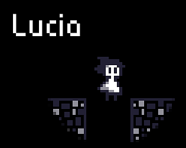

#  Lucia

### What is the story behind lucia?

Why is she here?

### Work In Progress

Lucia is a piece on interactive fiction about a witch with no powers, lost in a dark maze while dealing wit her past.

Move with arrows keys, close dialogues with enter.

Game developed for the [Mini Jam 8](https://itch.io/jam/mini-jam-8-fantasy).
Theme was fantasy, restriction was only one room.
Art heavily based in previous art by [Arks](https://arks.itch.io/witchcraft-spritesheet).
Font BitPotion by [Joeb Rogers](https://joebrogers.itch.io/bitpotion).

I got a bit ambitious, so this is mostly a work in progress.